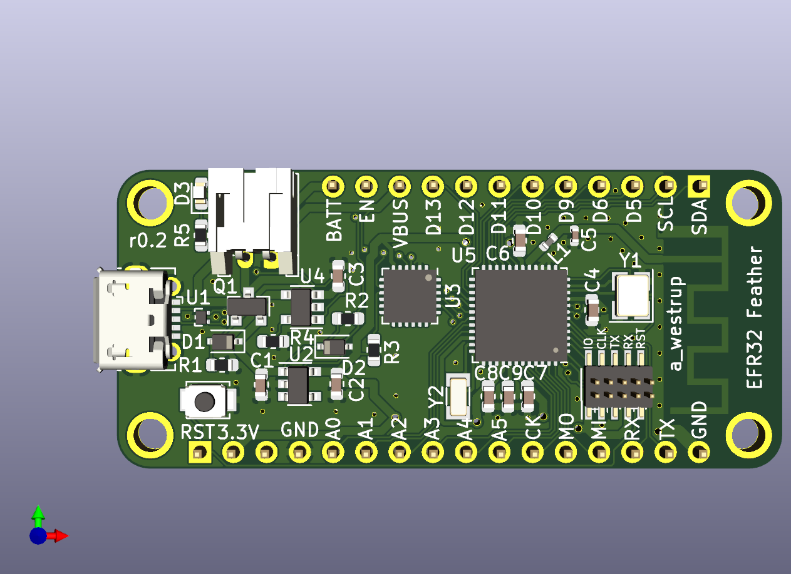

EFR32 Feather Board
===================

This is an Adafruit Feather compatible PCB with a Silicon Labs EFR32 MCU.
This MCU supports 2.4GHz radio such as BLE, Zigbee, Thread

Hardware components:
* MCU: EFR32 with 1024kB FLASH, 256kB RAM [EFR32MG12P332F1024GM48](https://www.silabs.com/products/wireless/mesh-networking/efr32mg-mighty-gecko-zigbee-thread-soc/device.efr32mg12p332f1024gm48)
* Alternative MCU: EFR32 with 512kB FLASH, 64kB RAM [EFR32BG13P532F512GM48](https://www.silabs.com/products/wireless/bluetooth/blue-gecko-bluetooth-low-energy-socs/device.efr32bg13p532f512gm48)
* USB Serial interface: [CP2102N](https://www.silabs.com/products/interface/usb-bridges/usbxpress-usb-bridges/device.cp2102n-qfn24)
* 3.3V LDO: [AP2112K](https://www.diodes.com/products/power-management/low-dropout-regulators/part/AP2112)
* Charging: [MCP73832](https://www.microchip.com/wwwproducts/en/MCP73832)

Firmware example:
* Using [Zephyr](https://www.zephyrproject.org/)
* Board definition in FW/boards/arm/efr32\_feather

Build instruction:

    mkdir FW/build
    cd FW/build
    source ZEPHYR-DIR/zephyr-env.sh
    cmake -Gninja ..
    ninja flash
